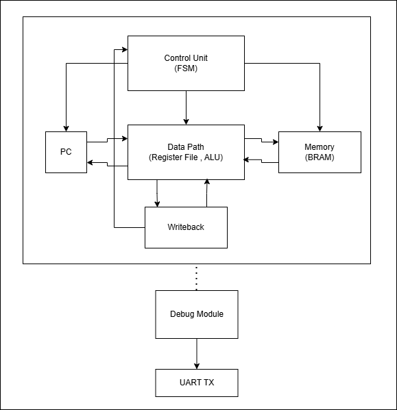

# RG Sonic32

[]()
[]()
[]()
[]()

A fully custom 32-bit CPU designed from scratch and deployed on a Xilinx Artix-7 FPGA (Alchitry Au V2). Custom ISA, hand-written RTL datapath and control unit, cycle-accurate simulation, hardware bring-up, and a passive UART debug module for real-time on-chip execution tracing — all implemented from scratch in Verilog.

---

## Hardware Results (v1)

| Metric | Value |
|---|---|
| Clock Frequency | 70 MHz |
| Timing Closure | ✅ WNS +0.260 ns |
| LUT Utilization | 7.72% |
| BRAM Utilization | 32% |
| Power (estimated) | ~95 mW |
| Control Unit | 14-state FSM |

---

## Architecture



RG Sonic32 is a multi-cycle processor. Each instruction traverses a sequence of FSM states sharing a common datapath:

```
FETCH → DECODE → EXECUTE → MEMORY → WRITEBACK
```

The control unit is a 14-state Mealy FSM that drives all datapath control signals. Execution is non-pipelined; each instruction occupies the full datapath sequentially, making behavior deterministic and easy to verify.

### ISA

Custom 32-bit instruction set with 6 instruction formats:

| Format | Description |
|---|---|
| R-Type | Register-register arithmetic and logic |
| I-Type | Immediate arithmetic, loads |
| S-Type | Stores |
| B-Type | Branches |
| U-Type | Upper immediate |
| J-Type | Jumps |

Full encoding and field definitions are documented in the [ISA Specification](v1/docs/v1%20Instruction%20Set%20Architecture%20(ISA)%20Specification.pdf).

### Memory Subsystem

- Instruction and data memory backed by on-chip BRAM
- Byte-addressable data memory with word-aligned access
- Separate address spaces for instruction fetch and data load/store

---

## Debug & Observability

RG Sonic32 v1 includes a hardware debug module (`debug.v`) that provides real-time execution tracing over UART without modifying CPU behavior.

### Design

The module is a **passive observer** instantiated at `cpu_top`. It taps into existing CPU signals — PC, IR, register writeback, store address/data, and halt — and streams structured trace records to a host terminal at 115200 baud.

Key implementation details:

- **Edge detection** on FSM state transitions prevents duplicate trace entries across multi-cycle states
- **20-entry synchronous FIFO** (circular buffer, 166 bits wide) decouples event capture from UART transmission rate
- **Halt sequencing**: the FIFO is fully drained before the halt string and register dump are emitted, preserving trace ordering
- **Passive tap**: zero impact on CPU timing or functional behavior

### Trace Format

```text
PC=FFFF0000 IR=0480000A RD=04 WB=0000000A   ← register writeback
PC=FFFF0010 IR=34C70000 ST A=00000000 D=0000001E  ← memory store
HALT
r00=00000000
r01=00000000
...
r31=00000000
```

### Smoke Test Output

Full execution trace from `test_mem.hex`, confirmed on hardware:

```text
PC=FFFF0000 IR=0480000A RD=04 WB=0000000A
PC=FFFF0004 IR=04A00014 RD=05 WB=00000014
PC=FFFF0008 IR=00C42800 RD=06 WB=0000001E
PC=FFFF000C IR=04E00100 RD=07 WB=00000100
PC=FFFF0010 IR=34C70000 ST A=00000000 D=0000001E
PC=FFFF0014 IR=29070000 RD=08 WB=0000001E
HALT
r04=0000000A  r05=00000014  r06=0000001E
r07=00000100  r08=0000001E
```

The trace validates a complete load → ALU → store → load-back sequence on real hardware. `r8 = r6 = 0x1E` confirms the store-load roundtrip through BRAM.

---

## Performance (v1)

From cycle-accurate RTL simulation:

| Metric | Value |
|---|---|
| Instructions Executed | 9 |
| Total Cycles | 57 |
| Average CPI | ~6.3 |
| Estimated Throughput | ~12.7 MIPS |

### Instruction Latency

| Instruction | Cycles |
|---|---|
| ADD / ADDI | 6 |
| SUB | 6 |
| SW | 8 |
| LW | 9 |
| BEQ | 5 |
| HALT | 1 |

The multi-cycle architecture establishes a performance baseline for direct comparison against the pipelined v2 design.

---

## Validation

| Check | Result |
|---|---|
| Cycle-accurate simulation | ✅ Pass |
| Hardware bring-up (Artix-7) | ✅ Pass |
| Register writeback correctness | ✅ Pass |
| Memory store / load roundtrip | ✅ Pass |
| Branch and control flow | ✅ Pass |
| UART debug trace (on hardware) | ✅ Pass |

---

## Documentation

| Document | Description |
|---|---|
| [ISA Specification](v1/docs/v1%20Instruction%20Set%20Architecture%20(ISA)%20Specification.pdf) | Custom instruction set encoding and field definitions |
| [Simulation & Performance Report](v1/docs/v1-mini%20Simulation%20%26%20Performance%20Report.pdf) | Functional correctness, execution trace, CPI, performance metrics |
| [Post-Implementation Report](v1/docs/v1-mini%20Post-Implementation%20Report.pdf) | Timing, utilization, and hardware implementation results |
| [Hardware Debug & Tooling](v1/docs/v1_Hardware_Debug_and_Tooling.pdf) | Debug module design, trace format, and PuTTY setup |

---

## Roadmap

### v1 ✅ Complete
- Custom ISA (6 formats)
- Multi-cycle RTL datapath and 14-state FSM control unit
- BRAM instruction and data memory
- Timing closure at 70 MHz on Artix-7
- Hardware bring-up and validation
- Passive UART debug module with FIFO-backed execution tracing

### v2 — In Progress
- 5-stage pipeline (IF / ID / EX / MEM / WB)
- Target CPI: 1–2
- Hazard detection and forwarding unit
- Performance comparison against v1 baseline

### v3 — Planned
- Standalone neural network accelerator
- AXI interconnect
- SoC integration

---

## Author

Ryan Gaffere
